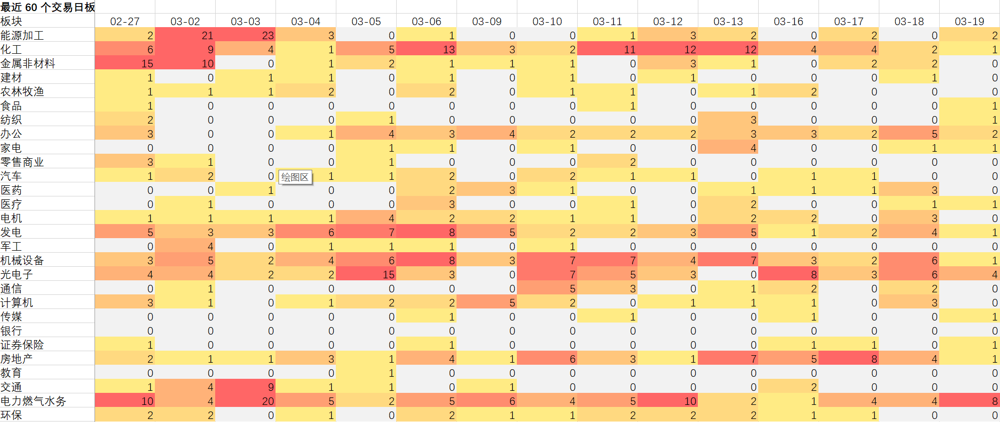
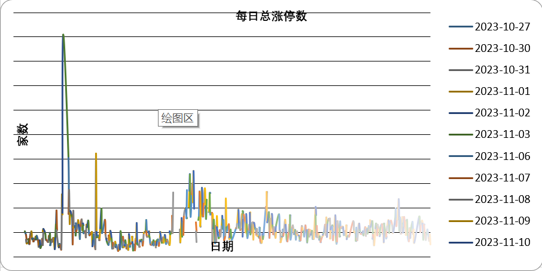

# LimitUp Sector Updater

A Windows-friendly Python tool for tracking daily limit-up counts across 28 A-share industry sectors, along with combined turnover of the Shanghai Composite Index and Shenzhen Component Index.

这是一个适用于 Windows 10 本地运行的 Python 工具，用于：
- 基于本地行业成分股映射表，统计 28 个行业板块的每日涨停数量
- 识别并展示二板、三板及以上连板股名称
- 统计上证指数与深证成指总成交额，以及相较前一交易日的变化
- 输出 Excel 结果，并自动生成 Dashboard 图表
- 支持增量更新与区间重算

---

## Features

- Read the latest `TDX_Industry_merged.xlsx` as the sector constituent source
- Track daily limit-up counts for 28 sectors
- Exclude `ST`, `*ST`, and related special-treatment stocks
- Show consecutive limit-up stock names for 2-board, 3-board, and higher
- Calculate combined turnover of:
  - Shanghai Composite Index (`000001`)
  - Shenzhen Component Index (`399001`)
- Generate Excel output and dashboard charts
- Support:
  - incremental update
  - rebuild for a date range
  - dashboard-only refresh
- Friendly for Windows users with `.bat` launcher

---

## Project Structure

```text
limitup-sector-updater/
├─ README.md
├─ LICENSE
├─ .gitignore
├─ requirements.txt
├─ limitup_sector_updater.py
├─ run_limitup_update.bat
├─ docs/
│  ├─ screenshot-main.png
│  └─ screenshot-dashboard.png
└─ examples/
   └─ config_example.txt
```

## Requirements

- Python 3.11+
- Windows 10 / Windows 11 recommended
- Internet access for fetching public market data
- Recommended packages are listed in `requirements.txt`

> Note:
>  This project depends on public market data interfaces. Temporary network instability or upstream interface changes may affect data fetching.

------

## Installation

Clone or download this repository, then install dependencies:

```
pip install -U -r requirements.txt
```

------

## Input Files

This tool expects the following input files from the user locally:

1. `TDX_Industry_merged.xlsx`
    Contains the latest 28-sector constituent stock mapping.
2. A statistics workbook template, for example:
    `2026-01 涨停板块统计（涨停数大于3标红加粗）.xlsx`

These files are **not included** in this repository because they may contain user-specific or continuously updated data.

------

## Usage

### 1. Incremental Update

```
python limitup_sector_updater.py --proxy-mode direct --industry TDX_Industry_merged.xlsx --stats "2026-01 涨停板块统计（涨停数大于3标红加粗）.xlsx" --output "涨停板块统计_自动更新.xlsx"
```

### 2. Rebuild for a Date Range

```
python limitup_sector_updater.py --mode rebuild --start-date 2026-02-01 --end-date 2026-02-28 --proxy-mode direct --industry TDX_Industry_merged.xlsx --stats "2026-01 涨停板块统计（涨停数大于3标红加粗）.xlsx" --output "涨停板块统计_重算.xlsx"
```

### 3. Refresh Dashboard Only

```
python limitup_sector_updater.py --mode dashboard --industry TDX_Industry_merged.xlsx --stats "涨停板块统计_自动更新.xlsx" --output "涨停板块统计_自动更新.xlsx"
```

### 4. Use the Windows Batch Launcher

Double-click:

```
run_limitup_update.bat
```

Or modify it to match your local file paths.

------

## Output

The tool generates an Excel workbook that includes:

- Daily sector-level limit-up counts
- Consecutive limit-up stock names
- Combined turnover of the Shanghai Composite Index and Shenzhen Component Index
- Day-over-day turnover change
- A `Dashboard` worksheet with charts

------

## Screenshots

> Add your screenshots into the `docs/` folder, then keep the links below.

### Main Excel Output


### Dashboard


```md
## What's New in v0.1.1

`v0.1.1` is a reliability and maintainability update on top of `v0.1.0`, focused on safer historical rebuilds, Dashboard refresh workflow, logging visibility, and better compatibility in proxy/network environments.

### Highlights

- Fixed the issue where empty limit-up pool responses could be silently written as `0`
- Added three running modes:
  - `update`: daily incremental update
  - `rebuild`: rebuild for a specified date range
  - `dashboard`: refresh Dashboard only
- Added `--proxy-mode auto/direct`
  - `auto`: use system/environment proxy first and automatically fall back to direct mode on proxy errors
  - `direct`: disable proxy environment variables from startup
- Improved logging
  - auto-generated log files
  - success/failed trading date summary
  - output path and log path tracking
- Added automatic Dashboard rebuild
  - daily total limit-up line chart
  - combined turnover line chart for SSE + SZSE indexes
  - turnover delta bar chart
  - last 60 trading days sector heatmap
- Improved abnormal date column detection and ignore logic
- Improved index history fetching by trying Eastmoney direct API first and falling back to akshare if needed

### Usage Examples

#### 1. Daily incremental update
​```bash
python limitup_sector_updater_v5.py ^
  --industry TDX_Industry_merged.xlsx ^
  --stats "涨停板块统计_自动更新.xlsx" ^
  --output "涨停板块统计_自动更新.xlsx"


## 更新说明（v0.1.1）

`v0.1.1` 是在 `v0.1.0` 基础上的一次稳定性和可维护性更新，重点改进了历史重算、Dashboard 刷新、日志可追踪性，以及代理环境下的数据抓取兼容性。

### 本版本更新内容

- 修复涨停股池返回空数据时被误写为 `0` 的问题，避免生成错误统计结果
- 新增三种运行模式：
  - `update`：日常增量更新
  - `rebuild`：指定区间重算
  - `dashboard`：仅刷新 Dashboard 图表页
- 新增 `--proxy-mode auto/direct`
  - `auto`：默认读取系统/环境代理，若检测到代理异常则自动切换直连
  - `direct`：启动时直接禁用代理环境变量
- 增强日志系统
  - 自动生成日志文件
  - 输出成功/失败交易日摘要
  - 记录输出文件与日志路径
- Dashboard 支持自动重建
  - 每日总涨停数折线图
  - 上证指数 + 深证成指总成交额折线图
  - 较前一日成交额变化柱状图
  - 最近 60 个交易日板块热力表
- 改进异常日期列识别与忽略逻辑
- 优化指数历史数据抓取逻辑，优先尝试东财直连接口，失败后回退到 akshare

### 使用示例

#### 1. 日常增量更新
​```bash
python limitup_sector_updater_v5.py ^
  --industry TDX_Industry_merged.xlsx ^
  --stats "涨停板块统计_自动更新.xlsx" ^
  --output "涨停板块统计_自动更新.xlsx"
```


------

## Notes

- This repository publishes the **tooling code only**
- User data files, generated Excel workbooks, logs, and private datasets should not be committed
- Some public interfaces may occasionally return SSL / connection / retry errors
- The script includes retry and fallback logic, but upstream instability may still occur

------

## Roadmap

-  Incremental update mode
-  Rebuild mode
-  Dashboard generation
-  Windows batch launcher
-  Retry and log output
-  Configurable sector alias matching
-  Better fallback sources for public market data
-  Optional command-line config file
-  Optional packaging for PyPI or Docker

------

## Example Maintenance Issue

You can create issues such as:

- Add configurable sector name aliases
- Improve retry strategy for unstable data source
- Add command-line config file support

This helps show the project is actively maintained.
## Screenshots

### Run Example



### Daily Summary



## Screenshots

### Run Example


### Daily Summary


